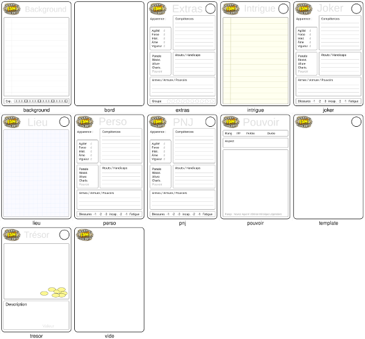
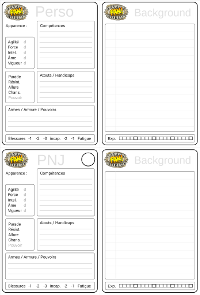
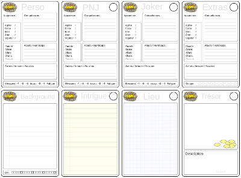

# Planches de Cartes Savage Worlds

Ayant lu avec beaucoup d'intérêt le livre [Lazy Dungeon Master](http://slyflourish.com/lazydm/), j'ai décidé de mettre en pratique ses recommandations avec [Savage Worlds](https://www.black-book-editions.fr/catalogue.php?id=58).

Pour résumer, *Lazy Dungeon Master* recommande de préparer ses parties en écrivant des fiches pour les personnages et adversaires, les lieux, les intrigues et les trésors. Ils suggèrent des fiches bristol de couleurs différentes pour les différents types (par exemple bleues pour les lieux, jaunes pour les trésors, vertes pour les intrigues, etc).

Je me suis dit qu'il serait bien de faire des mini fiches de personnage pour les PNJs, Extras et Jokers. J'ai donc conçus ces différentes fiches pour préparer mes parties. Voici par exemple une carte pour un *Joker* :

Par la suite, je me suis dit que ce serait une bonne idée de préparer d'autres fiches spécifiques pour les intrigues, lieux et trésors. Et puis j'ai fait d'autres fiches plus spécifiques à Savage Worlds, comme celle pour les pouvoirs.

Ayant de bons yeux, j'ai préféré les imprimer au format cartes *A7* (à peu près la taille des cartes à jouer), ce qui permet d'en mettre *8* sur une page au format *A4*. On peut aussi les imprimer en *A6* , on en met alors *4*, ou en *A5*, on passe alors à *2* par page.

On trouvera [dans l'archive](http://sweetohm.net/public/sawo-cards.zip) les images des cartes au format PNG. Pour les imprimer il faut produire des planches de *2*, *4* ou *8* cartes. On peut le faire avec un logiciel de manipulation d'image, comme Gimp par exemple. On peut aussi le faire en ligne de commande avec un script comme celui fourni dans l'archive, *planches.sh* qui utilise *ImageMagick* pour générer ces planches, mais cela nécessite d'installer *ImageMagick* et de l'appeler en ligne de commande.

## Composition des planches

Pour faciliter la réalisation de ses propres planches, j'ai conçu un service web qui permet de générer ces planches sur mon serveur. Pour l'appeler il faut d'abord obtenir une clef en m'envoyant un message à <casa@sweetohm.net> avec votre nom et adresse mail. Vous recevrez alors votre clef à envoyer lors des requêtes.

Pour voir les images des cartes disponibles, on pourra ouvrir dans son navigateur l'URL (où l'on remplacera *CLEF* par la clef reçue par mail) :

- <http://sweetohm.net:8000/CLEF>

Sous chaque carte est indiquée son nom. Pour générer un planche *2 x 2* avec les cartes *perso*, *background*, *pnj* et *background*, on appellera l'URL :

- <http://sweetohm.net:8000/CLEF/perso/background/pnj/background>

Il est possible de générer des planches *2 x 1*, *2 x 2* et *4 x 2*. On enverra alors sur l'URL *2*, *4* ou *8* noms de cartes. Pour récupérer la planches, faire un clic droit sur l'image et sélectionner dans le menu *Enregistrer l'image sous...*.

Autre exemple, pour faire une planche *4x2* avec les cartes principales, on appellera :

- <http://sweetohm.net:8000/CLEF/perso/pnj/joker/extras/background/intrigue/lieu/tresor>

Il est aussi possible de remplir les cartes avant de les imprimer. C'est ce que je fais pour préparer mes parties, je remplis les cartes avec mon Galaxy Note puis je les imprime par planches de *8* cartes que je compose avec un script qui appelle *ImageMagick* en ligne de commande.

Je trouve que ces cartes sont le meilleur moyen de mener une partie : on n'est pas perdu dans les pages du scénario, on peut étaler les fiches des personnages devant soi, on peut donner aux joueurs des cartes avec des indices ou des trésors, etc. J'imprime les feuilles de perso en format *A5* pour les joueurs et au format *A7* pour le moi.

*Enjoy!*
