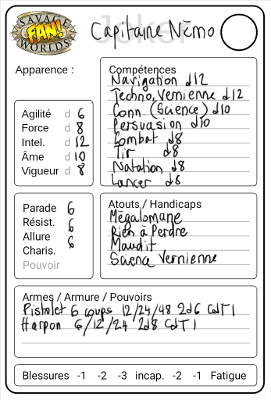

# Planches de Cartes Savage Worlds

Ayant lu avec beaucoup d'intérêt le livre [Lazy Dungeon Master](http://slyflourish.com/lazydm/), j'ai décidé de mettre en pratique ses recommandations avec [Savage Worlds](https://www.black-book-editions.fr/catalogue.php?id=58).

Pour résumer, *Lazy Dungeon Master* recommande de préparer ses parties avec des fiches pour les personnages (*extras* ou *jokers*), les lieux, les intrigues, etc. J'ai donc conçus des cartes pour préparer mes parties.

Voici par exemple une carte pour un *Joker* :

On trouvera dans l'archive les images des cartes au format PNG. Il est pratique d'en faire des planches pour les imprimer.

Pour ce faire, on pourra utiliser et modifier le script *planches.sh* qui utilise le logicle *ImageMagick* pour générer ces planches, mais cela nécessite d'installer des outils et de les appeler en ligne de commande.

Par conséquent, j'ai conçu un service web qui permet de générer ces planches. Pour l'appeler il faut d'abord obtenir une clef en m'envoyant un mail à <casa@sweetohm.net> avec votre nom et adresse mail. Vous recevrez alors votre clef à envoyer lors des requêtes.

Pour voir les images des cartes disponibles, on pourra ouvrir dans son navigateur l'URL :

- <http://sweetohm.net:8000/CLEF>

Où on templacera *CLEF* par la clef reçue par mail.

Sous chaque carte est indiquée son nom. Pour générer un planche *2 x 2* avec les cartes *perso*, *background*, *pnj* et *background*, on appellera l'URL :

- <http://sweetohm.net:8000/CLEF/perso/background/pnj/background>

Il est possible de générer des planches *2 x 1*, *2 x 2* et *4 x 2*.

*Enjoy!*
